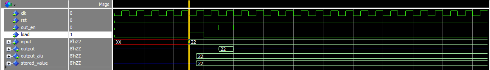

# 8-bit Processor
Implementing an 8-bit processor using VHDL.

 ## Block Diagram

- CLK: Used to generate clock signals for all the components at a frequency of  100 MHz.
- Arithmetic and Logical Unit (ALU): Performs addition and subtraction of two 8-bit numbers.
- Program Counter: It is a 4-bit special-purpose register used to sequence the execution of the program. It provides the address of the next instruction to memory which has to be executed.
- General Purpose Register: They are 8-bit registers (Register A and Register B). They are connected to the main bus as well as the ALU.
- Memory Address Register: It is a 4-bit register and it points to the memory location currently being accessed.
- Output Register: It is an 8-bit register. It is used to store the result of the arithmetic operations.
- Instruction Register: It is an 8-bit register. It holds the instruction currently being executed in the processor.
- Random Access Memory (RAM): 16 Bytes.
- Control Unit: It synchronizes all the processor operations with the CLK and generates the control signals necessary for communication between the processor and peripherals.

----
#### Program Counter

1. Counts from 0000 to 1111.
2. Asynchronous reset (rst)
3. 4-bit input Bus and 4-bit output Bus.
4. Load Enable (ld) and Enable Count (en) signals.

#### General Purpose Register

1. Load, Output enable and reset signals.
2. Asynchronous reset (rst)
3. 8-bit input and output lines.
4. Output port connected to ALU. --> Outputs whatever content is present in the register.

1. As soon as the load goes high the input value is stored into the register.
2. When the output enable is high we get the output at the otput port. 

#### Arithmetic and Logical Unit (ALU)

- **File**: alu.vhd
##### Diagram

##### Ports

| Port name | Direction | Type                         |
| --------- | --------- | ---------------------------- |
| en        | in        | std_logic                    |
| op        | in        | std_logic                    |
| reg_a_in  | in        | std_logic_vector(7 downto 0) |
| reg_b_in  | in        | std_logic_vector(7 downto 0) |
| carry_out | out       | std_logic                    |
| zero_flag | out       | std_logic                    |
| res_out   | out       | std_logic_vector(7 downto 0) |
