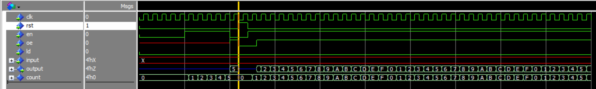

# 8-bit Processor
Implementing an 8-bit processor using VHDL.

 ## Block Diagram

- CLK: Used to generate clock signals for all the components at frequency of  100 MHz.
- Arithmetic and Logical Unit (ALU): Performs addition and subtraction of two 8-bit numbers. 
- Program Counter: It is a 4-bit special purpose register used to sequence the execution of programme. It provides the address if the next instruction to memory which has to be executed.
- General Purpose Register: They are 8-bit registers (Register A and Register B). They are connected to the main-bus as well as the ALU.
- Memory Address Register: It is a 4-bit register and it points to the memory location currently being accessed.
- Output Register: It is a 8-bit register. It is used to store the result of the arithmetic operations.
- Instruction Register: It is a 8-bit register. It holds the instruction currently being executed in the processor.
- Random Access Memory (RAM): 16 Bytes.
- Control Unit: It synchronizes all the processor operations with the CLK and generates the control signals necessary for communication between the processor and peripherals.

----
#### Program Counter

1. Counts form 0000 to 1111. 
2. Asynchronous reset (rst)
3. 4-bit input Bus and 4-bit output Bus.
4. Load Enable (ld) and Enable Count (en) signals.

